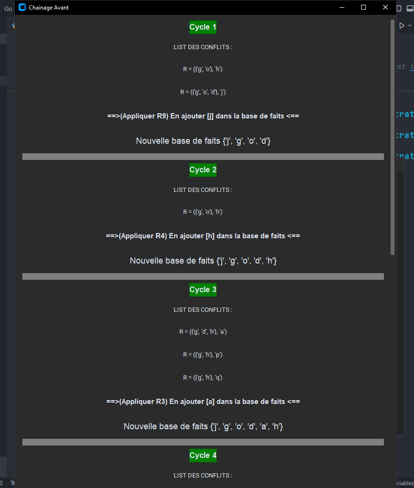

# IA-Project
Artificial intelligence University Project (system expert)
# Open file (To_run_it.txt) to install python libraries
# only version with customTkinter is working 100%

# Forward Chaining (see all in folder "execution"):

# Backward Chaining (see all in folder "execution"):

